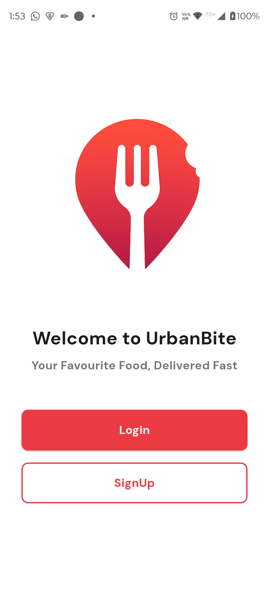
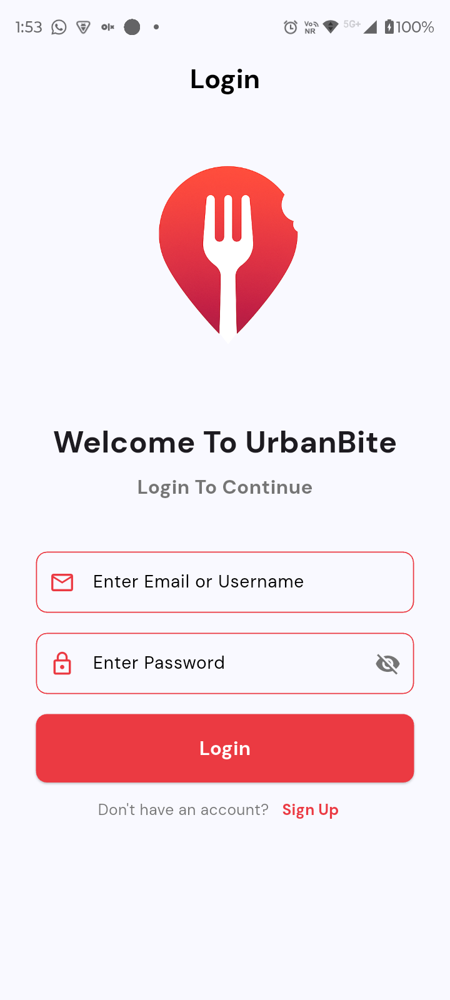
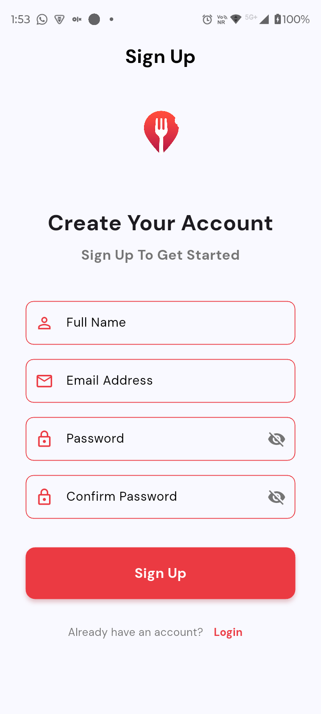
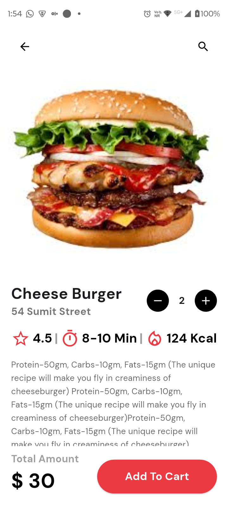
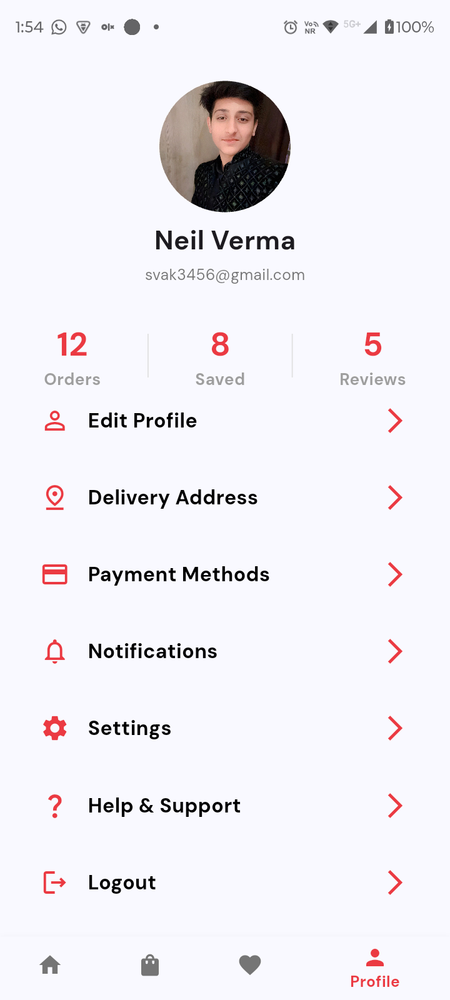

# 🍔 UrbanBite – Food Delivery App

**UrbanBite** is a modern and user-friendly Flutter app that brings your favorite food right to your doorstep. It features a clean interface for browsing restaurants, viewing food details, managing orders, and customizing your profile — all designed with a focus on seamless food ordering experience.

Built with **Flutter** and styled with **Google Fonts**, UrbanBite delivers a smooth and intuitive food delivery experience.

---

## 🧩 Features

### 👤 **Authentication & Onboarding**

* Welcome screen with app branding
* User login with email/username and password validation
* Sign up functionality for new users
* Secure password visibility toggle
* Form validation for user inputs

### 🏠 **Home Feed**

* Location-based food discovery
* Search functionality with voice input option
* Promotional carousel showcasing special offers
* **Trusted Picks** section with featured food items
* **Recommended** section with personalized suggestions
* Food cards displaying:
  - Restaurant name and location
  - Preparation time and calorie information
  - Ratings and pricing
  - High-quality food images

### 🍕 **Product Details**

* Detailed food item pages with full-screen images
* Quantity selector with increment/decrement controls
* Nutritional information (protein, carbs, fats)
* Rating, delivery time, and calorie display
* Customization options
* Add to cart functionality
* Real-time total amount calculation

### 📦 **Order Management**

* My Orders section for tracking past and current orders
* Order history and status tracking

### ❤️ **Saved Items**

* Save favorite food items for quick access
* View saved items in a dedicated section

### 👨‍💼 **User Profile**

* Profile overview with user stats:
  - Total orders count
  - Saved items count
  - Reviews count
* Profile customization options:
  - Edit profile information
  - Manage delivery addresses
  - Payment methods management
  - Notification preferences
  - App settings
  - Help & Support
* Secure logout functionality

### ⚙️ **Settings**

* App configuration and preferences
* User account management

---

## 🧠 Tech Stack

| Layer          | Tech Used                           |
|----------------|-------------------------------------|
| **Frontend**   | Flutter, Dart                       |
| **UI/UX**      | Material Design                     |
| **Typography** | Google Fonts (DM Sans)              |
| **Components** | Carousel Slider                     |
| **Platform**   | Android, iOS, Web, Windows, Linux, macOS |

---

## 📁 Folder Structure

```
urbanbite_gdgoc_v3/
├── lib/
│   ├── pages/              # All app screens
│   │   ├── StartPage.dart         # Welcome/Onboarding screen
│   │   ├── LoginScreen.dart       # User login
│   │   ├── SignUpScreen.dart      # User registration
│   │   ├── HomeScreen.dart        # Main navigation container
│   │   ├── HomePageContent.dart   # Home feed with food items
│   │   ├── ProductDetailPage.dart # Food item details
│   │   ├── MyOrders.dart          # Order history
│   │   ├── MyProfile.dart         # User profile
│   │   └── Settings.dart          # App settings
│   └── main.dart           # App entry point
├── assets/
│   ├── imageassets/        # App logos and profile images
│   └── foodimageassets/    # Food item images and promotions
├── android/                # Android platform files
├── ios/                    # iOS platform files
├── web/                    # Web platform files
├── windows/               # Windows platform files
├── linux/                  # Linux platform files
├── macos/                  # macOS platform files
├── pubspec.yaml            # Dependencies
└── README.md               # This file
```

---

## 🧪 Setup Locally

1. **Clone the repository**

```bash
git clone https://github.com/yourusername/urbanbite_gdgoc_v3.git
cd urbanbite_gdgoc_v3
```

2. **Install Flutter dependencies**

```bash
flutter pub get
```

3. **Verify Flutter setup**

```bash
flutter doctor
```

4. **Run the Flutter app**

```bash
flutter run
```

For a specific device:

```bash
# List available devices
flutter devices

# Run on specific device
flutter run -d <device_id>
```

---

## 📱 Platform Support

UrbanBite supports multiple platforms:

- ✅ **Android** - Fully supported
- ✅ **iOS** - Fully supported
- ✅ **Web** - Supported
- ✅ **Windows** - Supported
- ✅ **Linux** - Supported
- ✅ **macOS** - Supported

---

## 🎨 Design Features

* **Modern UI** - Clean and intuitive interface
* **Responsive Design** - Adapts to different screen sizes
* **Custom Color Scheme** - Brand colors (Red: `#EB3A42`, Blue: `#1883E7`)
* **Typography** - DM Sans font family for consistent text styling
* **Image Assets** - High-quality food and promotional images
* **Smooth Navigation** - Bottom navigation bar with PageView integration

---

## 🚀 Getting Started

### Prerequisites

- Flutter SDK (3.9.2 or higher)
- Dart SDK
- Android Studio / VS Code with Flutter extensions
- Xcode (for iOS development on macOS)
- Git

### Installation Steps

1. Ensure Flutter is installed and configured
2. Clone this repository
3. Navigate to the project directory
4. Run `flutter pub get` to install dependencies
5. Connect a device or start an emulator
6. Run `flutter run` to launch the app

---

## 📸 Screenshots

<div align="center"> 
 
 
 
 

<br><br> 
 

</div>

---

## 🔧 Development

### Project Structure

- **Pages**: All UI screens are located in `lib/pages/`
- **Assets**: Images and resources in `assets/` directory
- **Main Entry**: `lib/main.dart` contains the app initialization

### Key Dependencies

- `google_fonts: ^6.3.2` - Custom typography
- `carousel_slider: ^4.2.1` - Image carousel functionality
- `cupertino_icons: ^1.0.8` - iOS-style icons

---

## 🤝 Contributing

Contributions are welcome! Please feel free to submit a Pull Request.

1. Fork the repository
2. Create your feature branch (`git checkout -b feature/AmazingFeature`)
3. Commit your changes (`git commit -m 'Add some AmazingFeature'`)
4. Push to the branch (`git push origin feature/AmazingFeature`)
5. Open a Pull Request

---

## 📝 License

This project is licensed under the MIT License - see the LICENSE file for details.

---

## 👨‍💻 Author

**UrbanBite Team**

---

## 🙏 Acknowledgments

- Flutter team for the amazing framework
- Google Fonts for typography
- All contributors and testers

---

**Made with ❤️ using Flutter**
